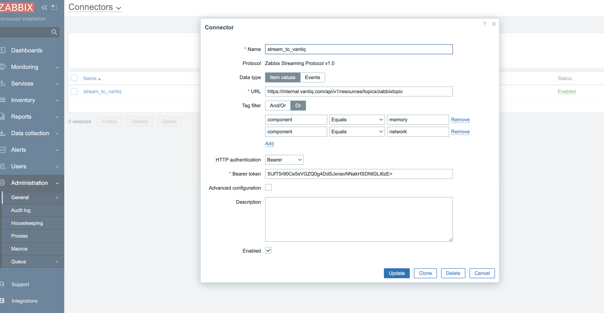
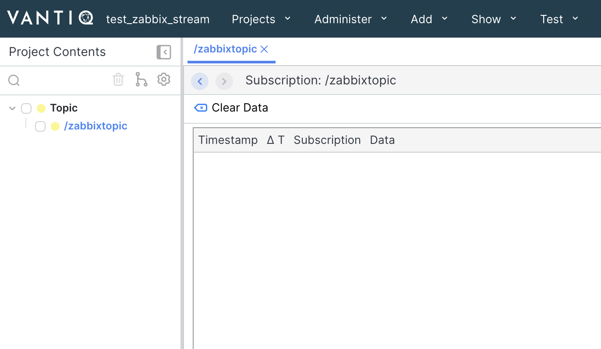
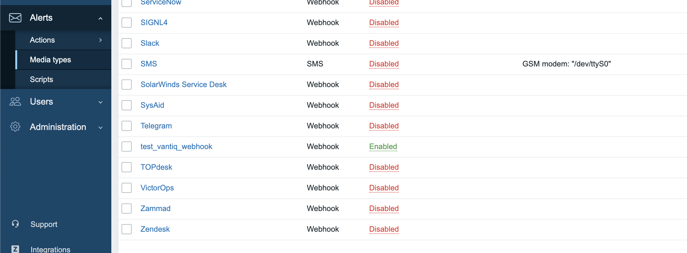
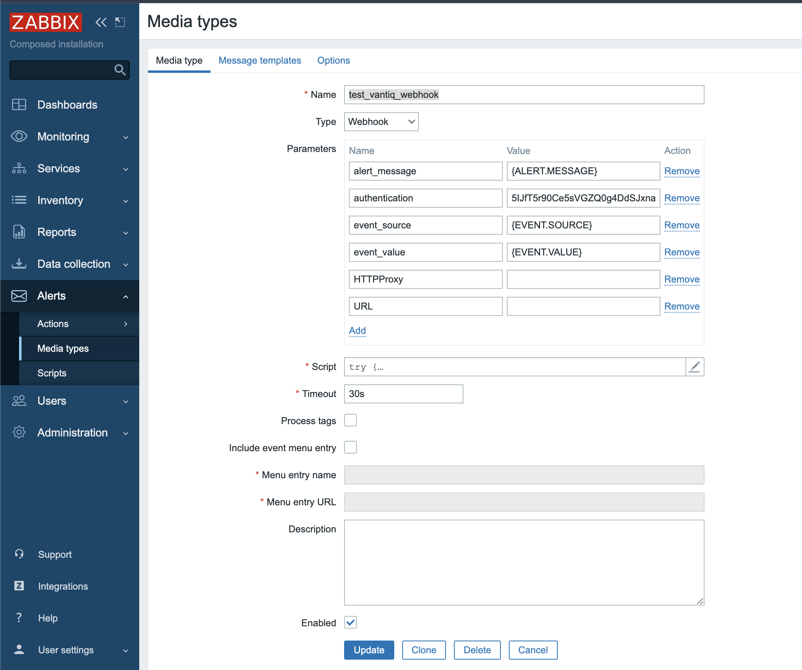
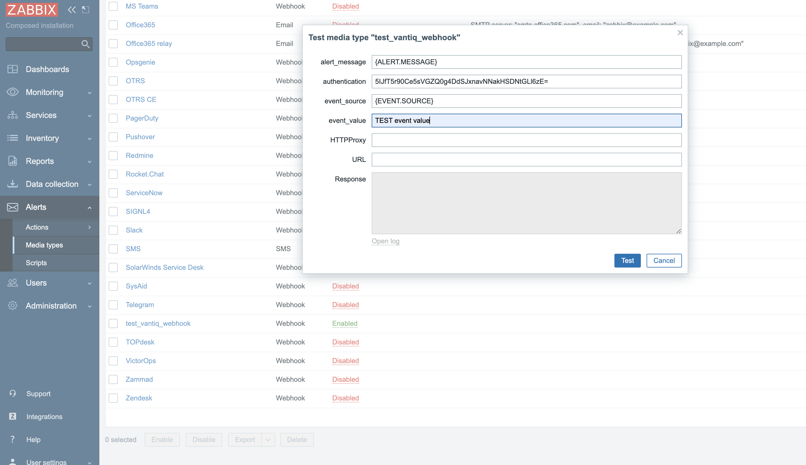
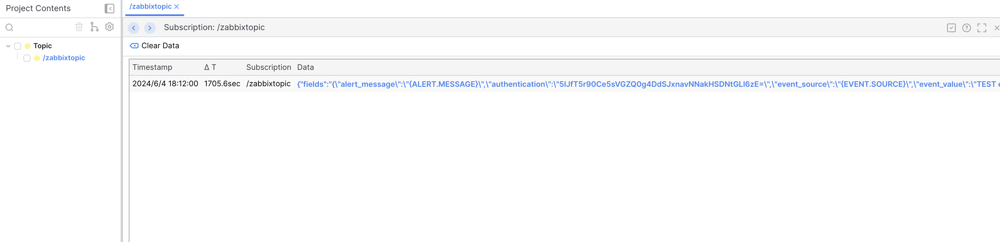
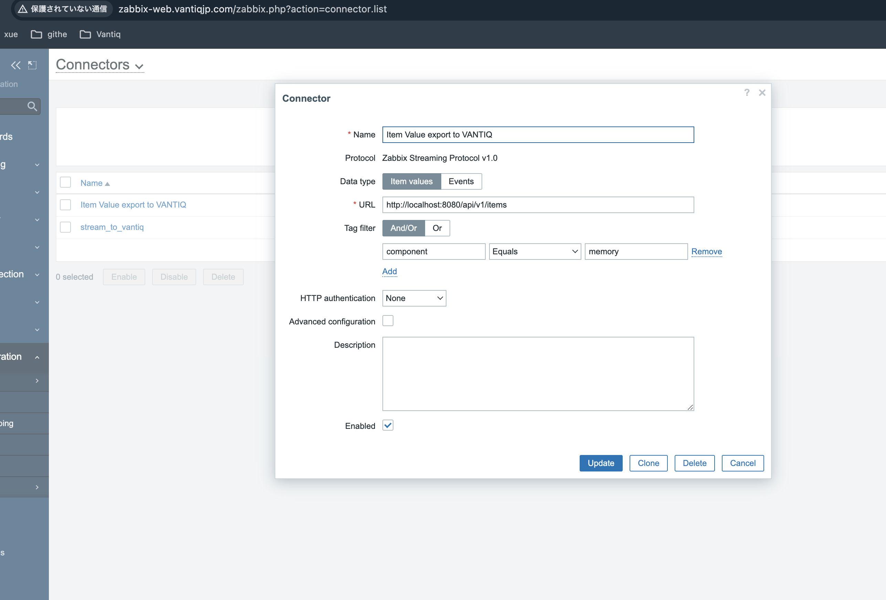
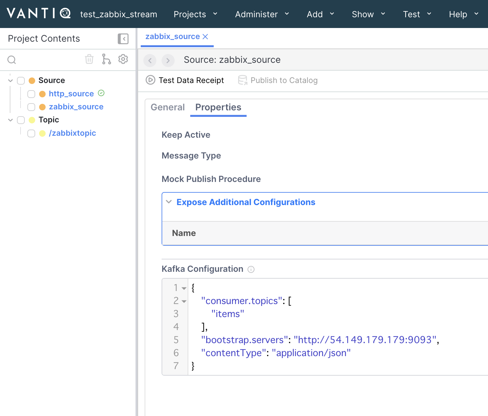
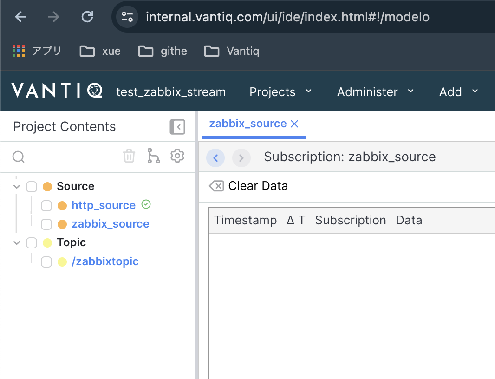

# Zabbixとのインテグレーション調査

- Zabbix Web, Server, Agent構築：　https://github.com/zabbix/zabbix-docker

## 構築手順
対象リポジトリクローンして、docker composeで起動
```
git clone https://github.com/zabbix/zabbix-docker
vi https://github.com/zabbix/zabbix-docker/blob/48a86dfa8de7a3d43a392de11aac95d792983e71/env_vars/.env_srv#L24C1-L24C24
```
`ZBX_STARTCONNECTORS`環境変数を0から1に修正、下記URLの「Configuration」　→ ２　の記載通りに`StartConnectors`変数を修正 （URLに記載しているのはバイナリー方式のインストール方法で、StartConnectors
変数のDockerバージョンの環境変数は`ZBX_STARTCONNECTORS`）
- 「2 Streaming to external systems」 セットアップ手順：　https://www.zabbix.com/documentation/7.0/en/manual/config/export/streaming
- Dockerバージョンの環境変数詳細など：　https://hub.docker.com/r/zabbix/zabbix-server-mysql/

Zabbix Web Nginx, Zabbix Server, MySQLを起動させる
```
docker compose -f docker-compose_v3_ubuntu_mysql_latest.yaml up -d
```

Zabbix Agent2構築： 
- 対象環境変数修正：

      `ZBX_HOSTNAME: "zabbix-agent"`
      `ZBX_SERVER_HOST: "10.0.0.208"`
      `ZBX_SERVER_PORT: '10051'`
- 環境変数詳細：　https://hub.docker.com/r/zabbix/zabbix-agent2/
```
wget -O docker-compose-agent2.yaml https://raw.githubusercontent.com/tsyunan-vantiq/kafka_connector_for_zabbix/main/docker-compose-agent2.yaml
docker compose -f docker-compose-agent2.yaml up -d
```

# Zabbix ServerからAgent Item　データをVANTIQに送信するできるかを検証

## Zabbix Connector

- https://www.zabbix.com/documentation/6.4/jp/manual/config/export/streaming

- 送信先：
  - [Kafka broker](https://git.zabbix.com/projects/ZT/repos/kafka-connector/browse)　公式Kafka connector
  - [Http server](https://git.zabbix.com/projects/ZT/repos/receiver/browse)　サンプルGolangアプリ、イベントとhistory データをファイルに書き込む

VANTIQ topicに送信することができるかを検証：
- http://zabbix-web.vantiqjp.com/zabbix.php?action=connector.list



送信できないです、なぜできないのが分からない


## Zabbix Alerts Webhook

既存Media Typeがないため、作成する

- http://zabbix-web.vantiqjp.com/zabbix.php?action=mediatype.edit&mediatypeid=42
- 

Webhookスクリプト：
```js
try {
    Zabbix.log(4, '[ VANTIQ webhook ] Started with params: ' + value);

    var result = {
        'tags': {
            'endpoint': 'vantiq'
        }
    },
        // value値はGlobal値らしくて、paramsを取得することができる
        params = JSON.parse(value),
        req = new HttpRequest(),
        fields = {},
        resp;
    // 
    if (params.HTTPProxy) {
        req.setProxy(params.HTTPProxy);
    }

    req.addHeader('Content-Type: application/json');
    req.addHeader('Authorization: Bearer ' + params.authentication);

    // fields.summary = params.summary;
    // fields.description = params.description;
    // fields.project = { key: params.project_key };
    // fields.issuetype = { id: params.issue_id };

    resp = req.post('https://internal.vantiq.com/api/v1/resources/topics/zabbixtopic',
        JSON.stringify({ "fields": value })
    );

    if (req.getStatus() != 201) {
        throw 'Response code: ' + req.getStatus();
    }

    resp = JSON.parse(resp);
    // result.tags.issue_id = resp.id;
    // result.tags.issue_key = resp.key;

    return JSON.stringify(result);
}
catch (error) {
    Zabbix.log(4, '[ VANTIQ webhook ] Event Post failed json : ' + JSON.stringify({ "fields": fields }));
    Zabbix.log(3, '[ VANTIQ webhook ] Event Post failed : ' + error);

    throw 'Failed with error: ' + error;
}
```

送信をテストする、送信はできるです。がAgent Itemデータを送信するには使える[Agent Itemデータ関連マクロ](https://www.zabbix.com/documentation/6.4/jp/manual/appendix/macros/supported_by_location)がなさそう、スクリプトの実装は厳しい

使えそうなマクロ：{ITEM.VALUE}
- https://www.zabbix.com/documentation/6.4/jp/manual/appendix/macros/supported_by_location




### まとめ：

- アラートWebHookはアラートイベント、障害イベントを通知するために使われている。
- Agent Itemデータのストーミングとの関係が見えない、Connectorを利用するを推奨。
- OSS上使えるHTTP requestできるConnectorがなさそう

### UPDATE 6/10

zabbix-connecter, kafka構築完了

```
ubuntu@ip-172-31-27-14:~/kafka-docker$ docker ps
CONTAINER ID   IMAGE                                             COMMAND                  CREATED         STATUS                    PORTS                                                                            NAMES
b3e7582a9a5b   kafka-connector                                   "./kafka-connector"      4 seconds ago   Up 3 seconds              0.0.0.0:8080->8080/tcp, :::8080->8080/tcp                                        agitated_herschel
8e9d739fa97c   bitnami/kafka:3.4                                 "/opt/bitnami/script…"   3 minutes ago   Up 3 minutes              0.0.0.0:9092-9093->9092-9093/tcp, :::9092-9093->9092-9093/tcp                    kafka-docker-kafka-1
febcce442f26   bitnami/zookeeper:3.8                             "/opt/bitnami/script…"   3 minutes ago   Up 3 minutes              2888/tcp, 3888/tcp, 0.0.0.0:2181->2181/tcp, :::2181->2181/tcp, 8080/tcp          kafka-docker-zookeeper-1
fa9d9ebba27c   zabbix/zabbix-server-mysql:ubuntu-6.4-latest      "/usr/bin/tini -- /u…"   6 days ago      Up 32 minutes             0.0.0.0:10051->10051/tcp, :::10051->10051/tcp                                    zabbix-docker-zabbix-server-1
5e72765e516b   zabbix/zabbix-agent2:latest                       "/sbin/tini -- /usr/…"   13 days ago     Up 32 minutes             0.0.0.0:10050->10050/tcp, :::10050->10050/tcp, 31999/tcp                         zabbix-docker-agent2-1
b82783c4a555   zabbix/zabbix-web-nginx-mysql:ubuntu-6.4-latest   "docker-entrypoint.sh"   13 days ago     Up 32 minutes (healthy)   0.0.0.0:80->8080/tcp, :::80->8080/tcp, 0.0.0.0:443->8443/tcp, :::443->8443/tcp   zabbix-docker-zabbix-web-nginx-mysql-1
715b234c0567   mysql:8.0-oracle                                  "docker-entrypoint.s…"   13 days ago     Up 32 minutes                                                                                              zabbix-docker-mysql-server-1
```

Zabbix Connector設定
http://zabbix-web.vantiqjp.com/zabbix.php?action=connector.list



VANTIQ側resource作成



受信できていない。。

